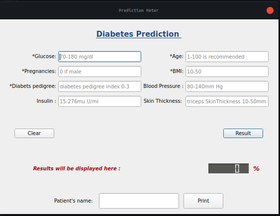
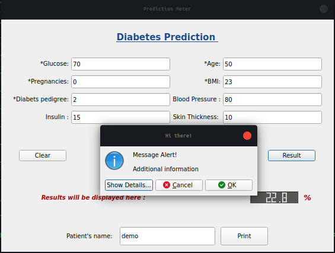

# Diabetes Prediction on PYQT5

its a pyqt5 application based on a famous dataset of diabetes detection it gives the result taking some inputs. 

it has a full fledged validation which is made for the user-friendly experience and prevents the unnecessary failure

Model used is a basic multi-layered perceptron used for classification

## instructions:
1. Install the requirements as in requirements.txt
2. open the termiinal or the ide in that directory 
3. run the application via command:  
    ##### python3 main.py

## screenshots are as follows:

 

 

### printing the report actually save the file as .pdf format that can be viewed in reports directory
